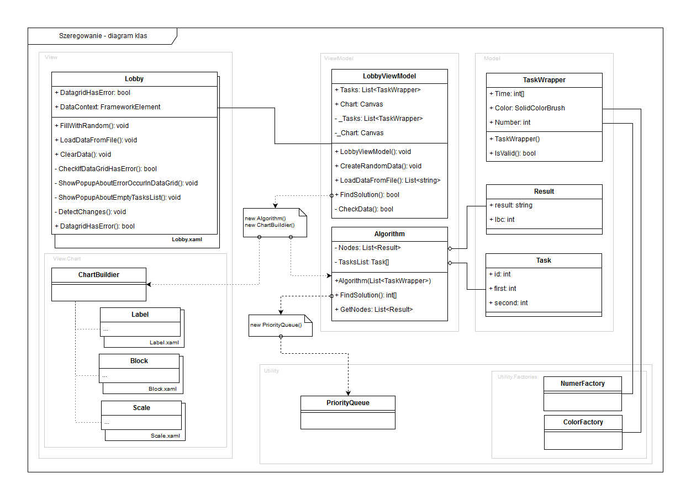
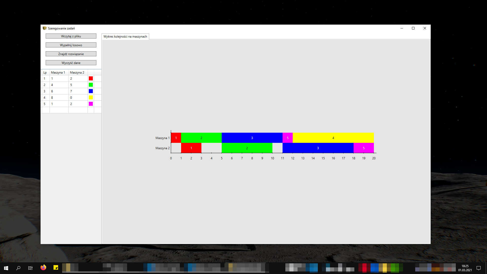
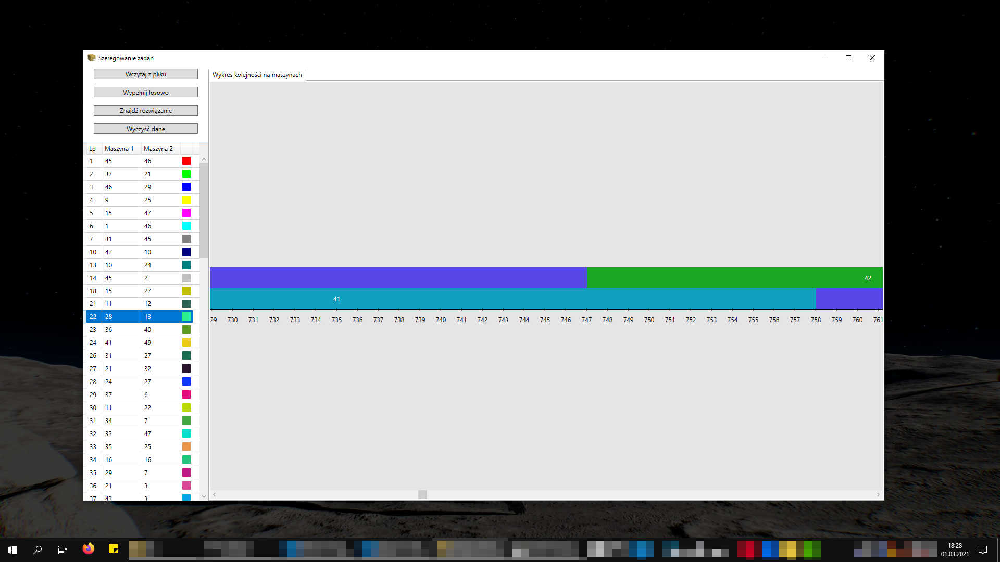

# Flow shop scheduling (szeregowanie w systemie przepływowym)
Application resolve flow shop scheduling problems using branch and bound algorithm.
It was first attempt to implement MVVM architecture in WPF application ([implementation.jpg](./preview/implementation.jpg)).

# EXE
* EXE file you can find inside [./bin](./bin).
* Application require .NET Framework 4.6 at least.

# Screens

